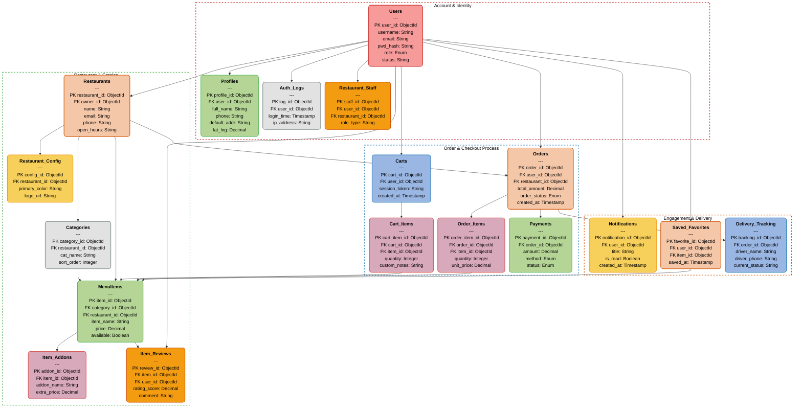

# 🎨 ThelaMomo Ultimate Capstone Database Model (Squeezed!)

```mermaid
%%{init: {"flowchart": {"nodeSpacing": 15, "rankSpacing": 20, "padding": 10}}}%%
flowchart TD

    %% -------------------------------------
    %% 1. ACCOUNT AND ACCESS DOMAIN
    %% -------------------------------------
    subgraph Security ["Account & Identity"]
        
        U["`**Users**
        ---
        PK user_id: ObjectId
        username: String
        email: String
        pwd_hash: String
        role: Enum
        status: String`"]

        P["`**Profiles**
        ---
        PK profile_id: ObjectId
        FK user_id: ObjectId
        full_name: String
        phone: String
        default_addr: String
        lat_lng: Decimal`"]

        AL["`**Auth_Logs**
        ---
        PK log_id: ObjectId
        FK user_id: ObjectId
        login_time: Timestamp
        ip_address: String`"]
        
        STAFF["`**Restaurant_Staff**
        ---
        PK staff_id: ObjectId
        FK user_id: ObjectId
        FK restaurant_id: ObjectId
        role_type: String`"]
    end

    %% -------------------------------------
    %% 2. CATALOG AND INVENTORY DOMAIN
    %% -------------------------------------
    subgraph Catalog ["Restaurant & Catalog"]
        
        RES["`**Restaurants**
        ---
        PK restaurant_id: ObjectId
        FK owner_id: ObjectId
        name: String
        email: String
        phone: String
        open_hours: String`"]

        RC["`**Restaurant_Config**
        ---
        PK config_id: ObjectId
        FK restaurant_id: ObjectId
        primary_color: String
        logo_url: String`"]

        CAT["`**Categories**
        ---
        PK category_id: ObjectId
        FK restaurant_id: ObjectId
        cat_name: String
        sort_order: Integer`"]

        M["`**MenuItems**
        ---
        PK item_id: ObjectId
        FK category_id: ObjectId
        FK restaurant_id: ObjectId
        item_name: String
        price: Decimal
        available: Boolean`"]

        ADDON["`**Item_Addons**
        ---
        PK addon_id: ObjectId
        FK item_id: ObjectId
        addon_name: String
        extra_price: Decimal`"]

        REV["`**Item_Reviews**
        ---
        PK review_id: ObjectId
        FK item_id: ObjectId
        FK user_id: ObjectId
        rating_score: Decimal
        comment: String`"]
    end

    %% -------------------------------------
    %% 3. CART AND CHECKOUT DOMAIN
    %% -------------------------------------
    subgraph Checkout ["Order & Checkout Process"]
        
        C["`**Carts**
        ---
        PK cart_id: ObjectId
        FK user_id: ObjectId
        session_token: String
        created_at: Timestamp`"]

        CI["`**Cart_Items**
        ---
        PK cart_item_id: ObjectId
        FK cart_id: ObjectId
        FK item_id: ObjectId
        quantity: Integer
        custom_notes: String`"]

        O["`**Orders**
        ---
        PK order_id: ObjectId
        FK user_id: ObjectId
        FK restaurant_id: ObjectId
        total_amount: Decimal
        order_status: Enum
        created_at: Timestamp`"]

        OI["`**Order_Items**
        ---
        PK order_item_id: ObjectId
        FK order_id: ObjectId
        FK item_id: ObjectId
        quantity: Integer
        unit_price: Decimal`"]

        PAY["`**Payments**
        ---
        PK payment_id: ObjectId
        FK order_id: ObjectId
        amount: Decimal
        method: Enum
        status: Enum`"]
    end

    %% -------------------------------------
    %% 4. ENGAGEMENT AND LOGISTICS
    %% -------------------------------------
    subgraph Engagement ["Engagement & Delivery"]
        
        NOT["`**Notifications**
        ---
        PK notification_id: ObjectId
        FK user_id: ObjectId
        title: String
        is_read: Boolean
        created_at: Timestamp`"]

        FAV["`**Saved_Favorites**
        ---
        PK favorite_id: ObjectId
        FK user_id: ObjectId
        FK item_id: ObjectId
        saved_at: Timestamp`"]

        DEL["`**Delivery_Tracking**
        ---
        PK tracking_id: ObjectId
        FK order_id: ObjectId
        driver_name: String
        driver_phone: String
        current_status: String`"]
    end

    %% -------------------------------------
    %% RELATIONSHIPS AND CARDINALITY 
    %% -------------------------------------
    
    %% Reduced edge length logic to smash subgraphs together
    U --> P
    U --> AL
    U --> STAFF
    
    U --> RES
    RES --> RC
    RES --> CAT
    CAT --> M
    RES --> M
    M --> ADDON
    M --> REV
    U --> REV

    U --> C
    C --> CI
    CI --> M
    
    U --> O
    RES --> O
    O --> OI
    OI --> M
    
    O --> PAY
    O --> DEL

    U --> NOT
    U --> FAV
    FAV --> M

    %% -------------------------------------
    %% STYLING (MATCHING YOUR APP'S EXACT COLORS)
    %% -------------------------------------
    
    style Security fill:transparent,stroke:#C9302C,stroke-width:2px,stroke-dasharray: 5 5,color:#000
    style Catalog fill:transparent,stroke:#5CB85C,stroke-width:2px,stroke-dasharray: 5 5,color:#000
    style Checkout fill:transparent,stroke:#2980B9,stroke-width:2px,stroke-dasharray: 5 5,color:#000
    style Engagement fill:transparent,stroke:#D35400,stroke-width:2px,stroke-dasharray: 5 5,color:#000

    %% Increased font-size to 16px to ensure readability when zoomed out, tighter RX edges
    classDef redBox fill:#F69A9A,stroke:#C9302C,stroke-width:2px,rx:8,ry:8,color:#000,font-family:sans-serif,font-size:16px;
    classDef greenBox fill:#B5D596,stroke:#5CB85C,stroke-width:2px,rx:8,ry:8,color:#000,font-family:sans-serif,font-size:16px;
    classDef peachBox fill:#F5C7A9,stroke:#D35400,stroke-width:2px,rx:8,ry:8,color:#000,font-family:sans-serif,font-size:16px;
    classDef pinkBox fill:#D8A9BA,stroke:#D9534F,stroke-width:2px,rx:8,ry:8,color:#000,font-family:sans-serif,font-size:16px;
    classDef yellowBox fill:#F7D05C,stroke:#F39C12,stroke-width:2px,rx:8,ry:8,color:#000,font-family:sans-serif,font-size:16px;
    classDef blueBox fill:#9AB6E3,stroke:#2980B9,stroke-width:2px,rx:8,ry:8,color:#000,font-family:sans-serif,font-size:16px;
    classDef greyBox fill:#E2E2E2,stroke:#7F8C8D,stroke-width:2px,rx:8,ry:8,color:#000,font-family:sans-serif,font-size:16px;
    classDef orangeBox fill:#F39C12,stroke:#D35400,stroke-width:2px,rx:8,ry:8,color:#000,font-family:sans-serif,font-size:16px;

    class U redBox;
    class P,M,PAY greenBox;
    class O,FAV,RES peachBox;
    class OI,CI,ADDON pinkBox;
    class NOT,RC yellowBox;
    class C,DEL blueBox;
    class CAT,AL greyBox;
    class STAFF,REV orangeBox;
```
